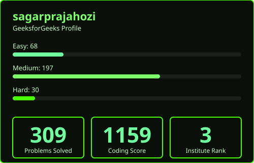

## Data Structures and Algorithms
<table>
<tr>
<td align="center" width="50%">

</td>

<td align="center" width="50%">

</td>
</tr>
</table>

## Featured Projects

<table>
<tr>

<td width="33%" valign="top" align="center">

### 🐍 Medusa RAG

 

 

 

Production-grade RAG API featuring two-level fallback routing, prompt versioning, observability, and Redis caching.

</td>

<td width="33%" valign="top" align="center">

### ⚡ Vulcan Engine

 

 

 

LangGraph multi-agent workflow engine with Planner, Researcher, Critic, and Redis execution tracing.

</td>

<td width="33%" valign="top" align="center">

### 🕸️ Madonna

 

 

 

Distributed key-value store in Go featuring WAL, gossip protocol, consistent hashing, and replication.

</td>

</tr>

<tr>

<td width="33%" valign="top" align="center">

### Athena

 

 

 

AI research assistant powered by LLaMA3 for document understanding, retrieval, and contextual QA.

</td>

<td width="33%" valign="top" align="center">

### AI Proctoring System

 

 

 

Real-time exam monitoring system using YOLOv8 computer vision for automated cheating detection.

</td>

<td width="33%" valign="top" align="center">

### URL Shortener API

 

 

 

High-performance URL shortener with analytics, QR generation, and Redis-backed caching.

</td>

</tr>
</table>

## Tech Stack & Tools

  

